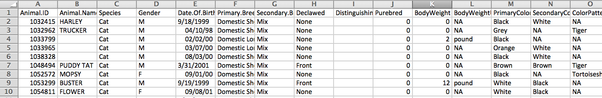
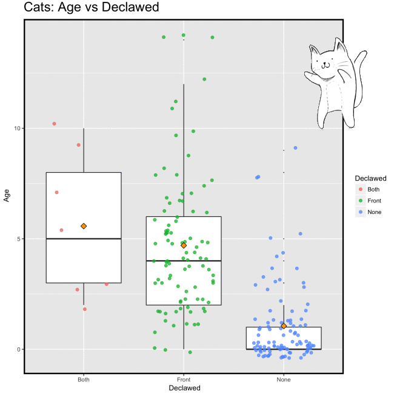

```{r setup, include=FALSE}
knitr::opts_chunk$set(echo = TRUE)
```

- The **R** language provides a rich and flexible environment for working with data, especially data to be used for statistical modelling or graphics.

- **R** is a comprehensive public domain language for data analysis, with no licensing costs associated with it. 

- Being independent of any platform, **R** is universally applicable and simple to integrate into existing IT structures.


You can download **R** for free from:  
<https://cran.r-project.org/>

and [**RStudio**](https://www.rstudio.com/), a free and open-source integrated development environment (IDE) for **R**  
<https://www.rstudio.com/>


## Data Science

- The new vast amount of data we have begun to take more and more notice of, has given a rise to the new discipline of data science.   

- Growing demand of data volume and easy understandability of extracted knowledge and insights from data is the motivating force of data science.

- With the explosion of “Big Data” problems, data science has become a very hot field in many scientific areas as well as marketing, finance, and other business and social study disciplines. Hence, there is a growing demand for business and social scientific researchers with statistical, modelling and computing skills. 

- We can now identify patterns and regularities in data of all sorts that allow us to advance scholarship, improve the human condition, and create commercial and social value.

- The field of data science is emerging at the intersection of the fields of statistics, computer science and design. **R** provides grate platform for this multidisciplinarity. It is incredibly powerful and as such it should be the first language for data manipulation, data analysis and visualisation you’re looking to grow skills in if you want to move towards data science.

## Why R?

a) The **R** system has an extensive library of packages that offer state-of-the-art-abilities.  
Many of the analyses that they offer are not even available in any of the standard packages. 

b) The functionalities of:
  - data manipulation, 
  - data analysis and 
  - visualisation implemented in **R** are incomparable.

c) **R** enables you to escape from the restrictive environments and sterile analyses offered by commonly used statistical software packages. 

d) **R** enables easy experimentation and exploration, which improves data analysis. 

e) **R** is a tool behind reporting modern data analyses in a reproducible manner making an analysis more useful to others because the data and code that actually conducted the analysis can be made available. 


## R Community


"The **R** community is one of **R**'s best features!" 
[Revolutions](http://blog.revolutionanalytics.com/) Daily news about using open source **R**


- Supported by the **R Foundation for Statistical Computing** and with the strong and open engagement of developers and users from all walks of background from science to commerce it is hard to envisage that any commercial corporation will be able to develop sustainable business model with the same innovative drive and power as **R community**.

- The collaboration amongst statisticians and other scientist who are engaged with statistical computing and growing interest and engagement of large companies creates altruistic **R community** which generates the force within which **R** is conquering the field of data analytics. As a result it creates a more powerful **R** resource and becomes more usable and attractive to Data scientists and analysists.


### List of resources

[ROpenSci](https://ropensci.org/): "**R** community is not just for 'power users' or developers. It's a place for users and people interested in learning more about **R**"; 
Provides list of useful links:

[#rstats hashtag](https://twitter.com/search?q=%23rstats) — a responsive, welcoming, and inclusive community of **R** users to interact with on Twitter

[R-Ladies](https://rladies.org/) — a world-wide organization focused on promoting gender diversity within the **R** community, with more than 30 local chapters

[Local R meetup groups](https://jumpingrivers.github.io/meetingsR/r-user-groups.html) — a google search may show that there's one in your area! If not, maybe consider starting one! Face-to-face meet-ups for users of all levels are incredibly valuable

[Rweekly](https://rweekly.org/) — an incredible weekly recap of all things **R**

[R-bloggers](https://www.r-bloggers.com/) — an awesome resource to find posts from many different bloggers using **R**

[DataCarpentry](http://www.datacarpentry.org/) and [Software Carpentry](https://software-carpentry.org/) — a resource of openly available lessons that promote and model reproducible research

[Stack Overflow](https://stackoverflow.com/) — chances are your R question has already been answered here (with additional resources for people looking for jobs)


## Who uses R?

Some of the major domains using **R** include:

- Financial Services, 
- Pharmaceuticals, 
- Telecom, 
- Life Sciences and 
- Education sector.

Top companies using **R** are :

- [Google](https://www.google.me), 
- [LinkedIn](https://www.linkedin.com/), 
- [Facebook](https://www.facebook.com/), 
- The [Financial Times](http://johnburnmurdoch.github.io/): Quantitative Journalism, 
- [Amazon](https://www.amazon.com) and many more...


## How do we do it?
Tools needed in a typical data science project:


**R for Data Science**
by Garrett Grolemund & Hadley Wickham 

<http://r4ds.had.co.nz/index.html>.


## Real Example

[Does declawing (onychectomy) cause harm to cats?](http://www.declawing-project.org/) Analyzing 17 years' worth of shelter admissions data.
- The dataset captures specifics about the individual cat (declawed status, age, breed, coat color, etc.) as well as the primary reason for admission.  Some of the admission reasons are unconnected to the animal (e.g., moving, can’t afford pet, allergies) — but some reasons are based on problematic behaviors exhibited by the cat (e.g., house-soiling, aggressive to other animals, aggressive to people). Available to us is a CSV file containing 200 sample records.



## Do it in R

```{r}
# Install and load packages and data 
# The tidyverse is a collection of R packages designed for data science
# Install the complete tidyverse with
# install.packages("tidyverse")
# load the complete tidyverse with
library(tidyverse)
# Install and load the ggplot2 package: grammer of graphics
# Install and load the magick package fo advanced image-processing in R
# install.packages("magick")
library(magick)
# load the data saved on your computer
# cat_claw <- read.csv("declawing_data_sample.csv")
# or load the data directly from the website
cat_claw <- read.csv("declawing_data_sample.csv")
# Have a look at the data: head()
# let us look at first three raws of the data
head(cat_claw, n = 3)
# Have alook at the structure of the data: str()
# look at the structure of the data
str(cat_claw)
# Do it in a tidy way: glimpse()
# previous output was messy as it didn't fit on the slide.
# we want tolook at the structure of the data as much data 
# as possible and identify data types for each of the variables
glimpse(cat_claw)
```

### What to focus on?
```{r}
# Note that variable 'Declawed' is the main variable of interest
# with three possible outcomes
summary(cat_claw$Declawed)
# sort the dates (DOB and InatekD) to be in the same format
cat_claw$Date.Of.Birth <- as.Date(cat_claw$Date.Of.Birth, format='%m/%d/%Y')
cat_claw$Intake.Date <- as.Date(cat_claw$Intake.Date, format='%m/%d/%Y')
# How does it look?
# check the data
glimpse(cat_claw)
```
### How old are the cats?
```{r}
# calculate age in days
cat_claw$diff_in_days <- cat_claw$Intake.Date - cat_claw$Date.Of.Birth
summary(cat_claw$diff_in_days) # summary for class type: 'difftime'
# summary for diff_in_days as numeric (does everything seem ok?)
summary(as.numeric(cat_claw$diff_in_days))
# Identify 'incorrect' observation(s)
# identify negative diff_in_days; how many?
ind <- which.min(as.numeric(cat_claw$diff_in_days))
ind
# remove observations with intake date before date of bearth
# save it as a new data set
cat <- cat_claw[-ind,]
# replace empty spaces with NA
cat$Animal.Name[cat$Animal.Name == ""] <- NA
cat$Distinguishing.Markings[cat$Distinguishing.Markings == ""] <- NA
cat$Reason[cat$Reason == ""] <- NA
# Check the data
glimpse(cat)
```
### What to plot?
Plot Age vs Declawed using Boxplot
```{r}
boxplot(as.numeric(diff_in_days) ~ Declawed, data = cat, horizontal = TRUE)
```

Can we make it more attractive looking?

### Create graph using ggplot
```{r}
#The image_graph() function opens a new graphics device similar to e.g. png() or x11(). 
# It returns an image objec to which the plot(s) will be written
fig <- image_graph(width = 600, height = 600, res = 96)

# plots Age (in years) vs Declawed and saves it as an image
ggplot(cat, aes(Declawed, round(as.numeric(diff_in_days)/365), 2)) + 
  geom_boxplot(outlier.size = 0) + 
  geom_jitter(position=position_jitter(width=0.30), shape = 20, size = 3, aes(colour=Declawed), alpha=0.75) + 
  stat_summary(fun.y=mean, shape=23, size = 3, fill = "orange", col= "black", geom='point') +
  labs (title= "Cats: Age vs Declawed ", x = " Declawed", y = " Age") +
  theme(panel.border = element_rect(fill = NA, colour = "black", size = 2)) +
  theme(plot.title = element_text(size = 20, vjust = 2)) +
  ggsave('~/Documents/my_R/RLadiesMNE/ggplot_image.png') 
```

### Adding an animation to a graph:
Read gif and background files
```{r}
# read cat gif file
cat_gif <- image_read("http://media.giphy.com/media/q0ujUmppx3Fu0/giphy.gif")  
#
# Background image
graph_bg <- image_read("~/Documents/my_R/RLadiesMNE/ggplot_image.png")
background <- image_background(image_scale(graph_bg, "650"), "white", flatten = TRUE)
# Combine and flatten frames
frames <- image_apply(cat_gif, function(frame) {
  image_composite(background, frame, offset = "+410+10")
})
```
```{r eval = FALSE}
# Turn frames into animation
animation <- image_animate(frames, fps = 10)
print(animation)
```




# Happy Plotting!
